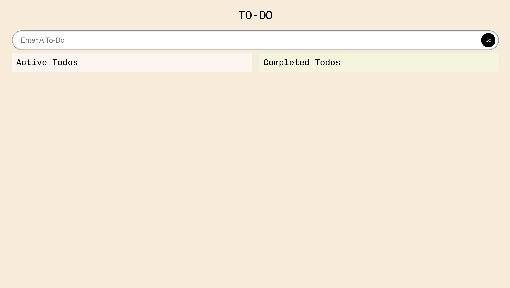

# React Portolio
  
  ## ReadMe Description 

  This is a simple TypeScript application to track Todo's! You are able to create a todo and drap it into a completed section after you're done. Thank you for checking it out!

  ## Table of Contents: 

  * [Installation](#installation) 

  * [Contributors](#contributors) 

  * [Usage](#usage) 

  * [Tests](#tests) 

  * [Questions](#questions) 

  * [License](#license) 

  ## Name: 

  Sebastian Tischner
  ## Installation 

  no installation
  ## Contributors 

  none
  ## Usage 

  run npm install to download node modules, and then run the command of npm start  
  ## Tests 

  none
  ## License 
 
  This project is protected by the MIT license.
  ## Questions 

  Github: [Sebascrab](https://github.com/Sebascrab) 

  Deployed Link: [Link](https://typescript-todo-app-sebas.netlify.app/)

  Email: alexanders.tischner@outlook.com 

  